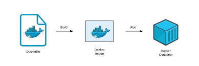

<div align="center">
  <h1> How to create own Docker Image using Dockerfile </h1>
</div>


## What is Dockerfile ?
A Dockerfile is a text document that contains all the commands a user could call on the command line to assemble an image. 
<br>



## Keywords of Dockerfile 

**FROM** : This keyword specifies the base image on which we want our image to be built on. 

**RUN** : Builds your container

**CMD** : This keyword is used to run commands when the container is started

**COPY** : This Keyword is used to copy a file from host os to docker container

**EXPOSE** : This keyword is used to expose a port inside of the Docker image to the outside world.


## Steps to create own Docker Image using Dockerfile 

### Step 1: Make a directory

### Step 2. create a file named Dockerfile and open the file using any editor

**Example**

```
FROM centos:latest
RUN yum install python36 -y
CMD python3
``` 
**And save the file**

### Step 4: Build/Run the code 
```
docker build  <directory_name>  -t  <Your_image_nmae>:<version> 
``` 

### Step 5. Now launch a container using above created Image
```
docker run -i -t  --name <Container_name>  <your_image_name>:<versions>
```

